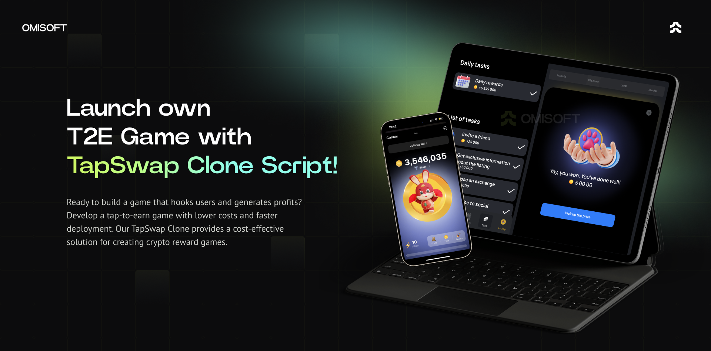

# TapSwap Script | Case Study & Custom Telegram Bot Solution

This repository showcases the **TapSwap Script**, a foundation for a Telegram-based Web3 Clicker Game. As a case study, it demonstrates how businesses can leverage our white-label solution to quickly launch their own engaging TapSwap-like game. 

**Ready to build your own game?** We provide end-to-end product implementation, so you can focus on marketing and scaling your community while we handle the technology.

## Why Choose This Solution?

Our TapSwap Script reduces development time and costs, offering a ready-made yet customizable white-label solution for Web3 projects. This approach ensures you can launch your game in record time with robust features and seamless integration.

## Features Included in the Solution

### Core Functionality

- **Telegram Bot**: Fully integrated with Telegram as a Mini App.
- **User Authorization**: Secure login via Telegram.
- **Mobile Optimization**: Designed for an exceptional mobile experience.
- **Admin Panel**: Manage game settings and monitor performance effortlessly.
- **Figma Design File**: Customizable UI/UX design assets.
- **Localization**: Multilingual support for global reach.
- **DDoS Protection**: Advanced security for uninterrupted gameplay.
- **CI/CD Pipelines**: Automated deployments and updates.
- **Referral Program**: Incentivized growth for community building.
- **Marketing Tools**: Includes social tasks, Google Analytics, and Microsoft Clarity.

### Additional Features on Request

- Landing Page  
- Blog Integration  
- Social Media Integration  
- Crypto Deposit & Withdrawal  
- Mobile Application  
- Support Bot  
- Loot Boxes and Competitions  
- Marketing Bonuses (Join Bonus, Daily Bonus)  
- Any custom feature you envision!  

## Technology Overview

Built with a cutting-edge tech stack to ensure performance, scalability, and flexibility.

  
Front End (App & Admin Panel)

  <ul>
      <li>React.js</li>
      <li>Redux Toolkit</li>
      <li>TypeScript</li>
      <li>Wagmi</li>
      <li>Jest (Unit Testing)</li>
  </ul>

  
Back End

  <ul>
      <li>Node.js</li>
      <li>Express.js</li>
      <li>TypeScript</li>
      <li>MongoDB & Mongoose</li>
      <li>Swagger (API Documentation)</li>
      <li>Jest & Supertest (Testing)</li>
  </ul>

  
Blockchain

  <ul>
      <li>Solidity (Smart Contracts)</li>
  </ul>

  
DevOps

  <ul>
      <li>Docker</li>
      <li>GitLab CI</li>
      <li>AWS Services</li>
  </ul>

## Pricing Packages

|                     | Basic Package      | NoFee Package | Special Offer  |
|---------------------|--------------------|---------------|----------------|
| Revenue Share       | 5%                 | 0%            | 0%             |
| Maintenance Cost    | Free               | $2,000/year   | Free           |
| Community Size      | -                  | 10,000+       | 50,000+        |
| Custom Design       | Logo & Colors Only | Fully Custom  | Fully Custom   |
| Initial Cost        | $10,000            | $20,000       | Contact Us     |

## Request a Demo

See the TapSwap Script in action and learn how we can customize it for your needs.  

- <a href="https://telegram.me/omisoft" target="_blank">Contact Us on Telegram</a>  
- <a href="https://omisoft.net/contact-us?utm_campaign=tapswap-clone&utm_medium=social&utm_source=github" target="_blank">Visit Our Website</a>  
- [Email Us Directly](mailto:hi@omisoft.net)  

## Supported Networks

Our TapSwap Script is compatible with a wide range of networks:  

- TON, Tron, Ethereum, Arbitrum, Optimism, Polygon, Base, BNB Chain, Avalanche, Celo, Blast, Polkadot, Solana, and others.  
- Don’t see your preferred network? Contact us to discuss integration.

## Frequently Asked Questions

  
What is the TapSwap Script?

  
The TapSwap Script is a white-label Telegram Clicker Game designed to lower community-building costs for Web3 projects. Popular examples include NotCoin and Hamster Kombat games.

  
How much time does it take to launch?

  
As a white-label solution, deployment takes less than a month—3-4 times faster than custom development.

  
What is included in the pricing packages?

  
Basic and NoFee packages differ by revenue share, maintenance costs, and customization level. Contact us for details about the Special Offer package tailored for large communities.

  
Can the product be hosted on our servers?

  
Yes, we can configure CI/CD pipelines to ensure smooth updates and deployments on your infrastructure.

## Next Steps

Ready to turn the TapSwap Script into your own engaging Telegram game? Contact us to bring your vision to life.  

Explore similar solutions:  

- [Crypto Lottery](https://omisoft.net/demo/crypto-lottery)  
- [White-Label NFT Marketplace](https://omisoft.net/demo/whitelabel-nft-marketplace-development)  
- [ICO & IDO Launchpad](https://omisoft.net/demo/white-label-crypto-launchpad-development)  
